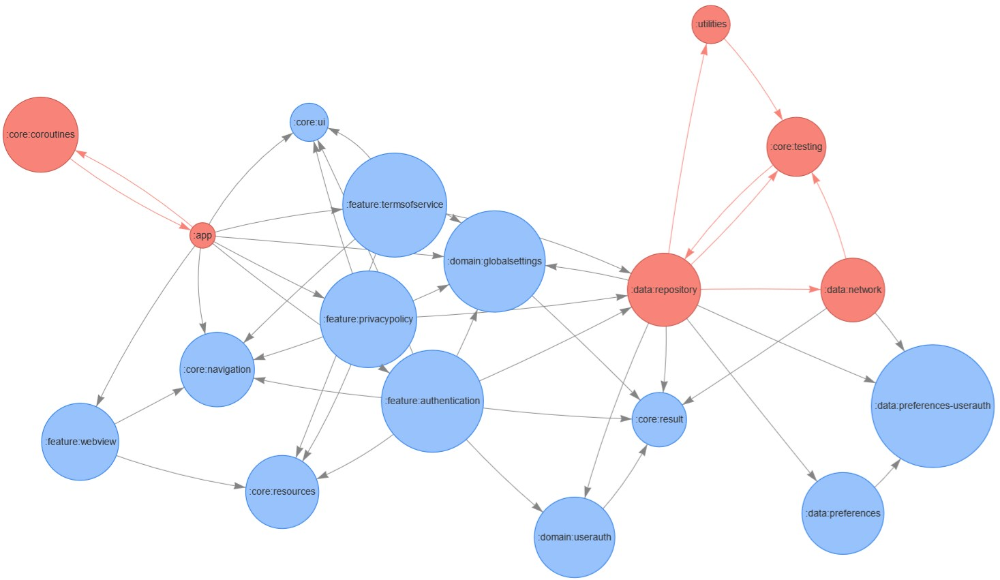

# Intro

Generates dependency graph for project modules in Android multimodule project. Works only if modules have their project
dependencies declared in their `build.gradle` file. In case of a circular dependency, modules that cause circular
dependency will be marked on a dependency graph with different color.

### How it works

Project modules are retrieved from `settings.gradle`, and each module `build.gradle` is checked for a dependencies.
<br>
<br>
Example where module `app` has a dependency on module `core:navigation`:

```groovy
> settings.gradle

include ':app'
include ':core:navigation'
```

```groovy
> app > build.gradle

dependencies {
    implementation project(':core:navigation')
}
```

<br>
Generated dependency graph:
<br>
<br>
<div align="center">

</div>

<br>
Circular dependency graph:
<br>
<br>
<div align="center">

</div>

# Instructions

- Install python dependencies from `requirements.txt` file.
- Run `python main.py`
- Enter Android project path.
  <br>
  <br>

Tested on Chris Banes [Tivi](https://github.com/chrisbanes/tivi)
and Google's [Now in Android](https://github.com/android/nowinandroid) projects.