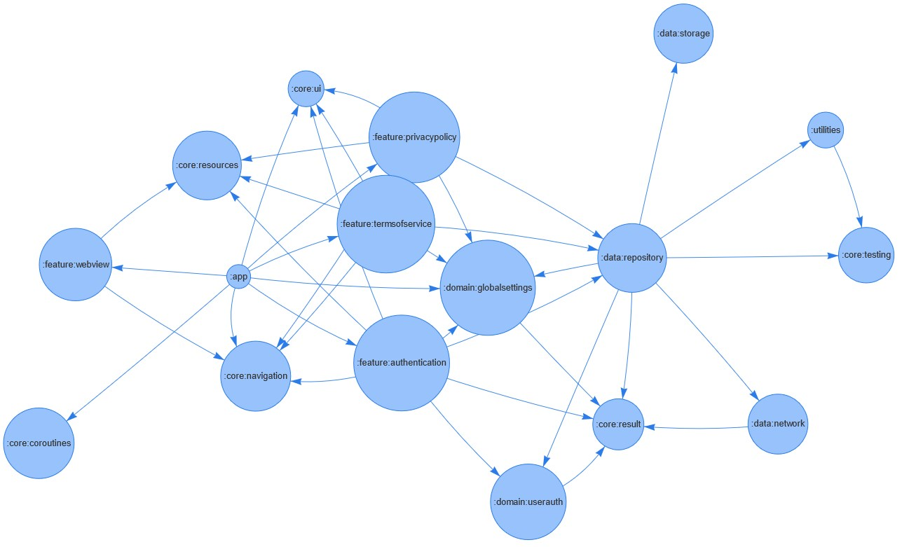

# Intro

Generates dependency graph for project modules in Android multimodule project. Works only if modules have their project
dependencies declared in their `build.gradle` file.

### How it works

Project modules are retrieved from `settings.gradle`, and each module `build.gradle` is checked for a dependencies.
<br>
<br>
Example where module `app` has a dependency on module `core:navigation`:

```groovy
> settings.gradle

include ':app'
include ':core:navigation'
```

```groovy
> app > build.gradle

dependencies {
    implementation project(':core:navigation')
}
```
<br>
Generate graph example:
<br>
<br>
<div align="center">

</div>

# Instructions

- Install python dependencies from `requirements.txt` file.
- Run `python main.py`
- Enter Android project path.